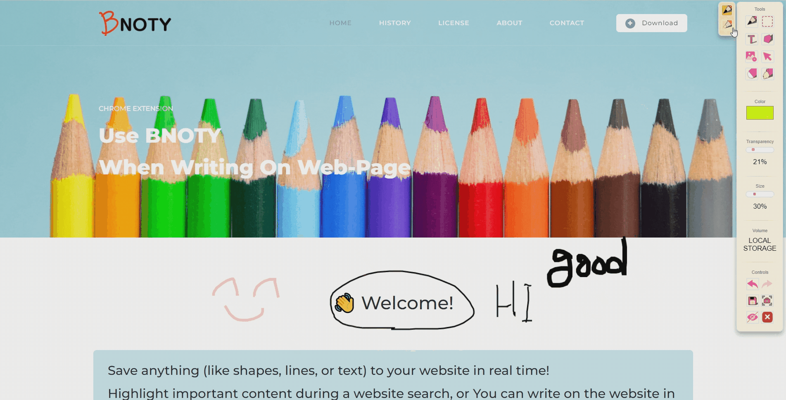
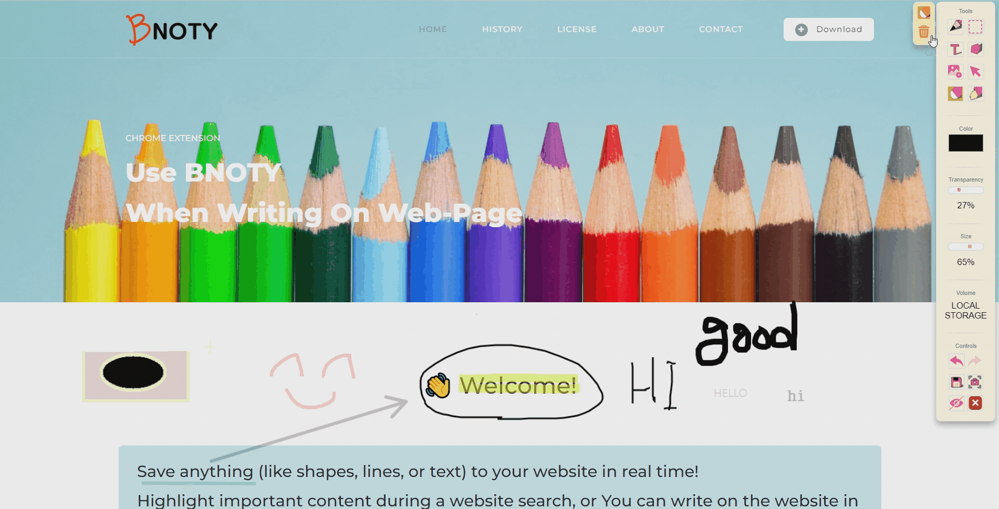
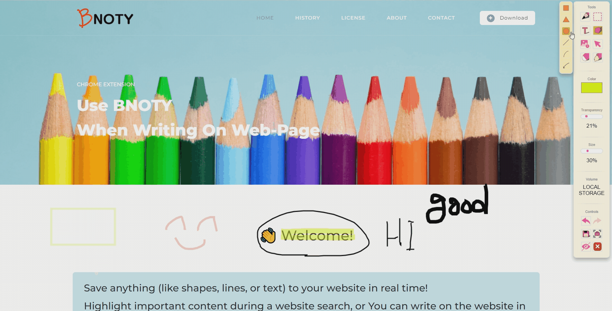
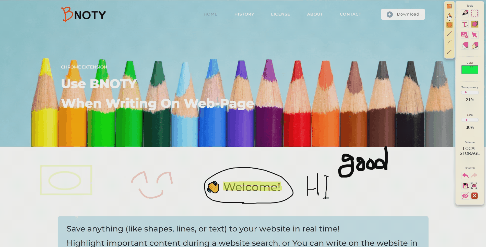
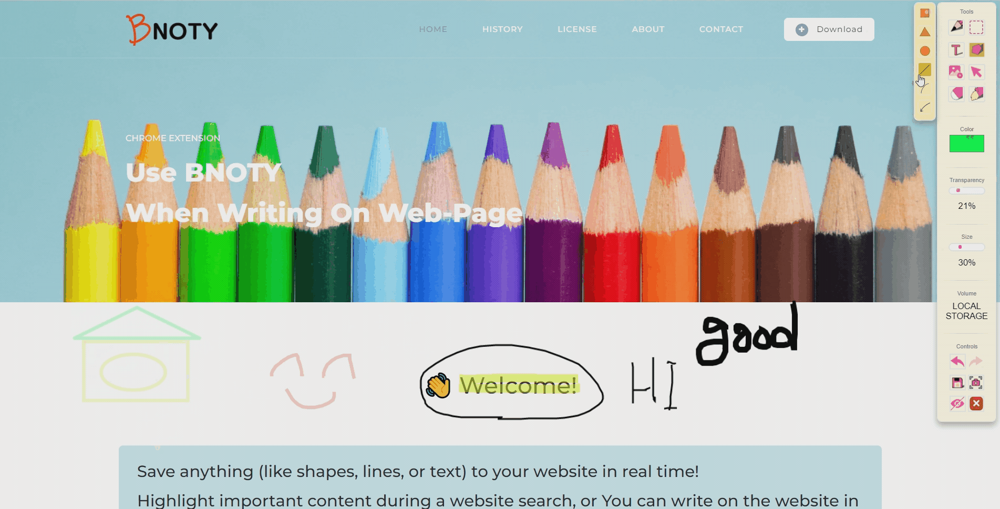
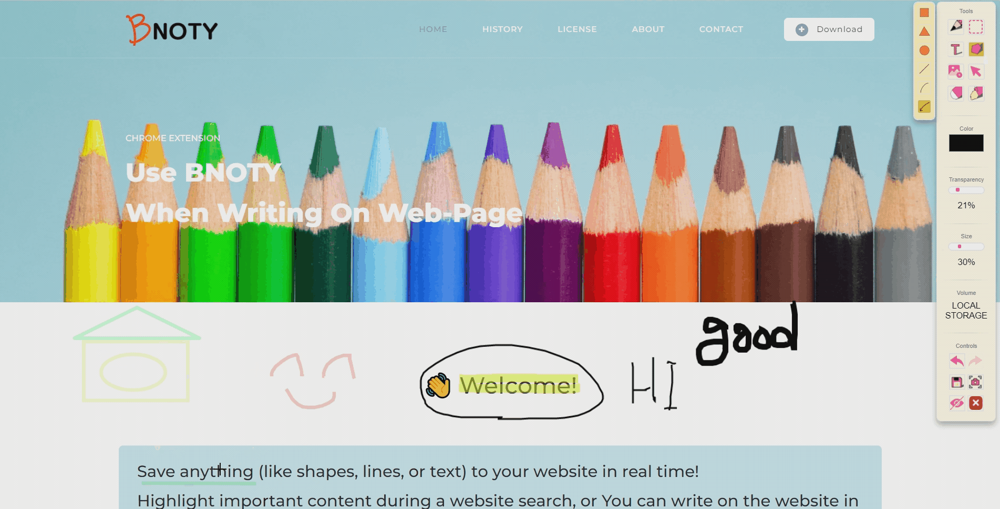
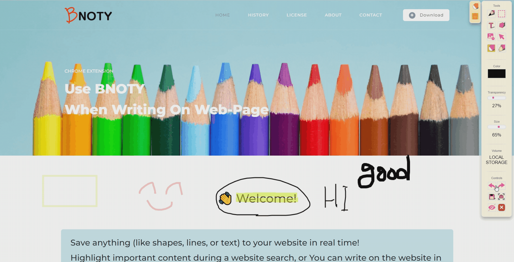
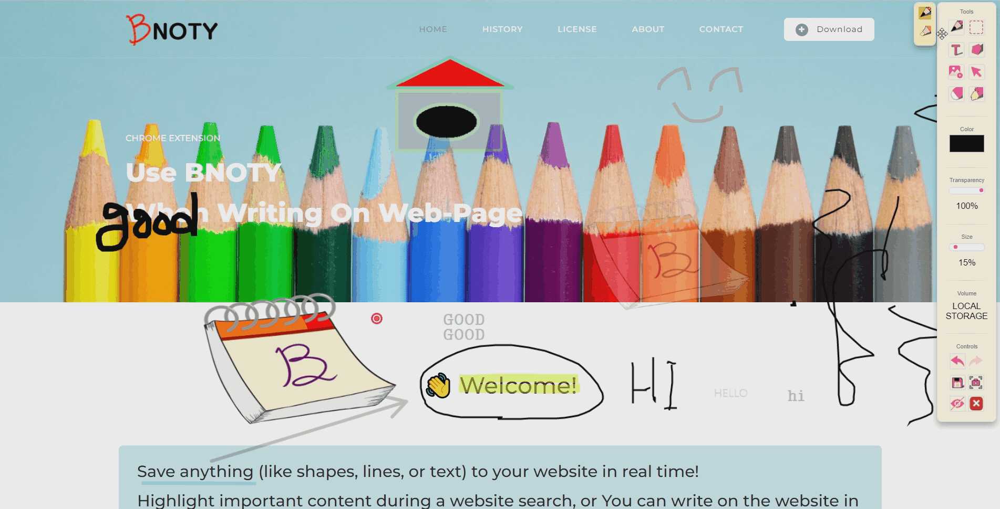

<h1 align="center">BNOTY</h1>

### 목차

---

1. [프로젝트 소개](#-프로젝트-소개)
2. [사용스택](#사용스택)
3. [Project Period](#project-period)
4. [Constributors](#constributors)
5. [기능 상세](#기능-상세)
6. [라이센스](#라이센스)

---

## 📖 프로젝트 소개

`BNOTY`는 웹에서 필기하고 해당 내용을 저장하여 다른 기기에서도 확인할 수 있는 크롬 확장프로그램입니다.

🏠 [BNOTY 홈페이지](https://bnoty.github.io/BNOTY-HomePage/index.html)

📷 [프로젝트 영상](https://youtu.be/6EFw0Rd010Y)

📜 [노션](https://chief-burglar-5af.notion.site/B-Noty-c431c6720f164b6392034d44b9c1e958)

-   기획배경
    -   코로나19로 인해 온라인 수업이 많아지고 이로 인해 온라인 수업 자료들이 많아짐.
    -   온라인 수업 자료에 필기를 하고 싶지만 필기를 하는 것이 어렵다.
    -   필기한 내용을 다른 기기에서도 바로 확인을 할 수 있다면 좋을 것 같다는 생각을 하였다.
    -   비슷한 기능을 제공하는 확장 프로그램이 있지만 한글을 지원하지 않는다.

---

## 사용스택

| 용도      | 스택                                                                                                                                                                                                           | 버전  |
| --------- | -------------------------------------------------------------------------------------------------------------------------------------------------------------------------------------------------------------- | ----- |
| 코드 편집 |                                                                                        | v1.64 |
| DB        |                                                                                                               |       |
| 형상관리  |                                                                                                                      |       |
| 협업      |  |       |

---

## Project Period

2022.04.11 - 2022.05.20 (6주)

---

## Constributors

| 팀원   | 역할                             | 비고 | 깃허브                            |
| ------ | -------------------------------- | ---- | --------------------------------- |
| 김재욱 | 텍스트, 이미지, 올가미           |      | https://github.com/blackvill      |
| 류기탁 | 부팀장, 스크린샷, 링크, 리팩토링 | 아이콘 제공 | https://github.com/alwaysryu      |
| 오제노 | 팀장, 펜, 채우기, 메인툴, 마우스모드|      | https://github.com/ohzeno         |
| 우윤식 | UI, UX, 메인툴                   |      | https://github.com/Y1sik          |
| 정순일 | 도형, 올가미, 색상, 디버깅       |      | https://github.com/JUNGSOONIL     |
| 최상후 | firebase 데이터 저장, 불러오기   |      | https://github.com/Neungji-Baksal |

---

## 기능 상세

-   펜

    -   펜

        

    -   형광펜

        

-   지우기

    -   부분 지우기

        

    -   전체 지우기

        

-   도형

    -   사각형

        

    -   동그라미

        

    -   삼각형

        

    -   실선

        

    -   화살표

        

-   텍스트

    

-   채우기

    

-   이미지 및 링크 삽입

    -   이미지 삽입

        

    -   링크 삽입

        

-   스크린샷

    -   현재 페이지 스크린샷

        

    -   전체 화면 스크린샷

        

-   올가미

    

-   편집

    -   이전

        

    -   이후

        

-   저장

    

-   마우스

    

-   툴

    -   이동

        

    -   숨기기

        

---

## 라이센스

### MIT License

```
Copyright (c) <2022> <BNOTY>

Permission is hereby granted, free of charge, to any person
obtaining a copy of this software and associated documentation
files (the "Software"), to deal in the Software without
restriction, including without limitation the rights to use,
copy, modify, merge, publish, distribute, sublicense, and/or sell
copies of the Software, and to permit persons to whom the
Software is furnished to do so, subject to the following
conditions:

The above copyright notice and this permission notice shall be
included in all copies or substantial portions of the Software.

THE SOFTWARE IS PROVIDED "AS IS", WITHOUT WARRANTY OF ANY KIND,
EXPRESS OR IMPLIED, INCLUDING BUT NOT LIMITED TO THE WARRANTIES
OF MERCHANTABILITY, FITNESS FOR A PARTICULAR PURPOSE AND
NONINFRINGEMENT. IN NO EVENT SHALL THE AUTHORS OR COPYRIGHT
HOLDERS BE LIABLE FOR ANY CLAIM, DAMAGES OR OTHER LIABILITY,
WHETHER IN AN ACTION OF CONTRACT, TORT OR OTHERWISE, ARISING
FROM, OUT OF OR IN CONNECTION WITH THE SOFTWARE OR THE USE OR
OTHER DEALINGS IN THE SOFTWARE.
```
