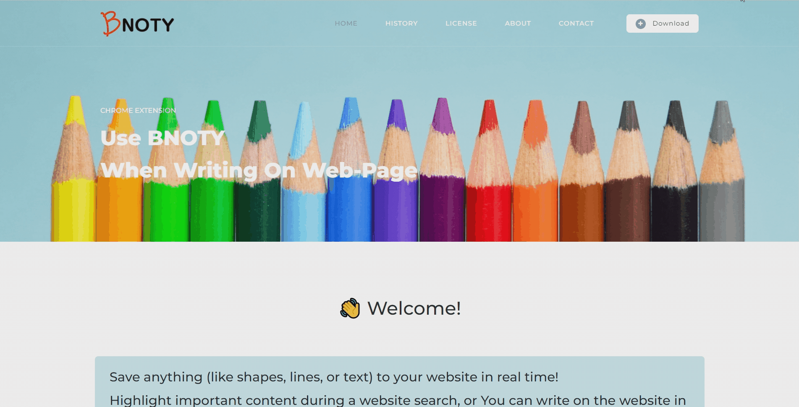
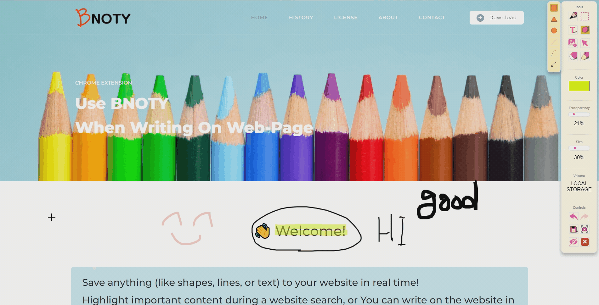
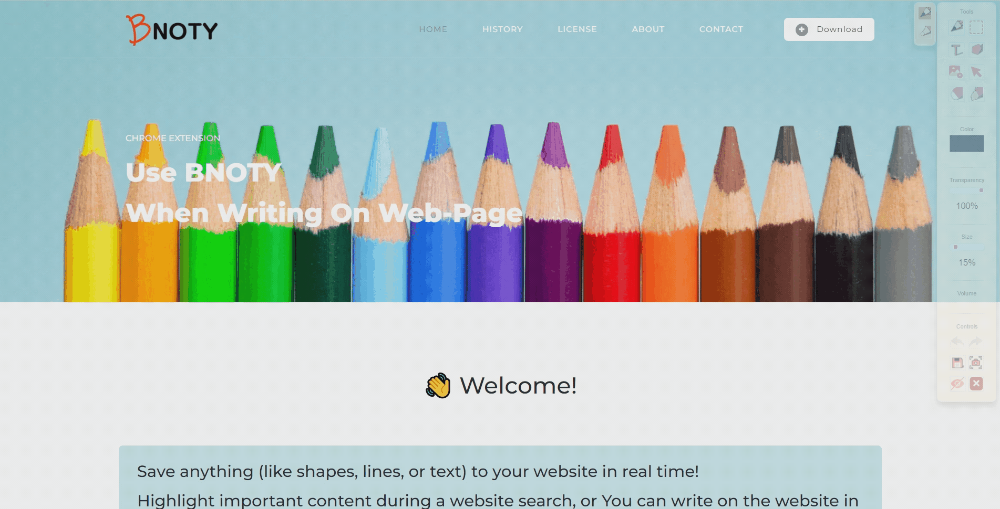
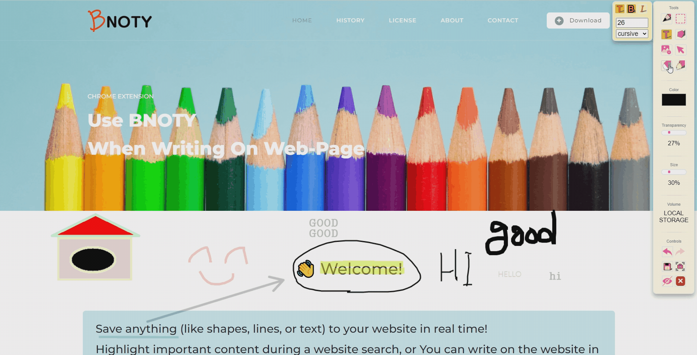
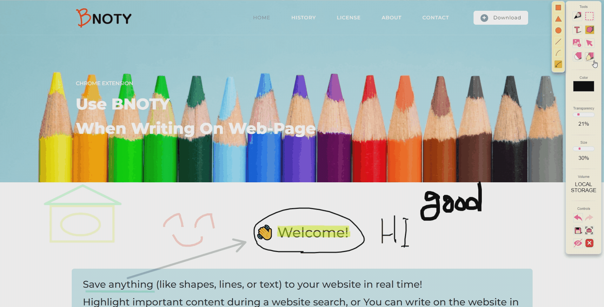
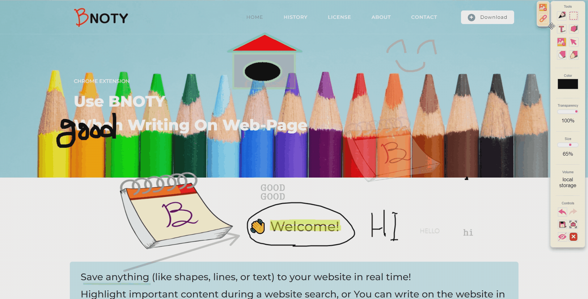
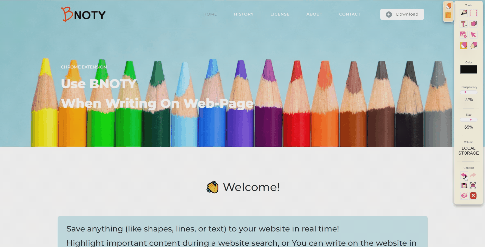
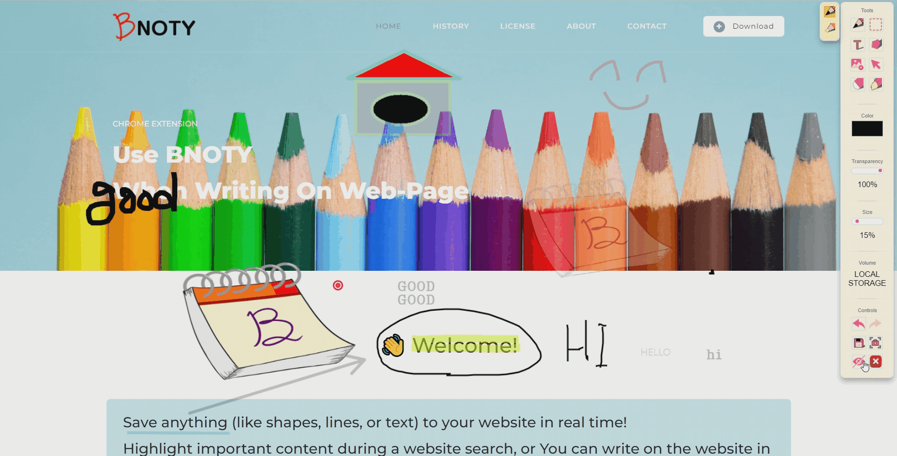
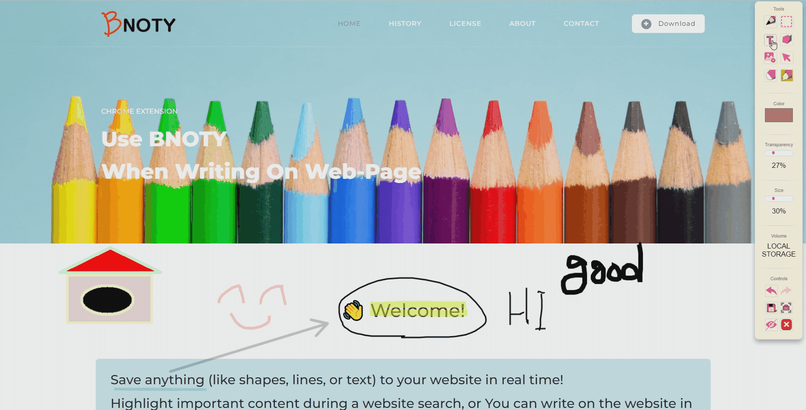
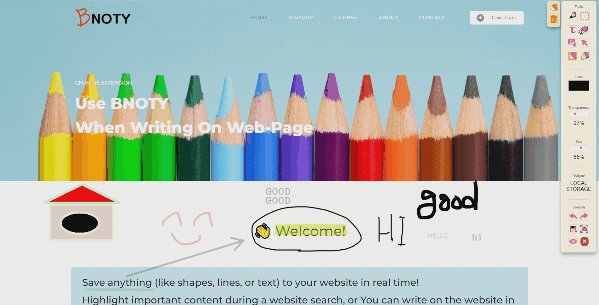

### 기술스택

------

- Visual Studio Code
  - Prettier
- Canvas
  - [Docs](https://developer.mozilla.org/en-US/docs/Mozilla/Add-ons/WebExtensions)
- FireBase
  - FireStore DataBase
  - gtatic Firebasejs 7.2.3


### 빌드 세팅 상세

------

- FireBase Setting

  - ```js
    const firebaseConfig = {
      apiKey: "",
      authDomain: "",
      databaseURL:
        "",
      projectId: "",
      storageBucket: "",
      messagingSenderId: "",
      appId: "",
      measurementId: "",
    };
    ```

  - Firebase.js 첫번째 줄 firebaseConfig 정보 입력
  - 해당 내용은 **파이어베이스 콘솔 → 프로젝트 설정 → 일반** 에서 확인가능 


- 확장 프로그램 빌드 (Mainfest V2 버전 지원 중단으로 Chrome 마켓 배포 연기)
  - [s06-final / S06P31S207 · GitLab (ssafy.com)](https://lab.ssafy.com/s06-final/S06P31S207)에서 코드 다운로드
  - [chrome://extensions/](chrome://extensions/ ) 로 접속
  - 우측 상단의 개발자 모드 **ON**
  - 
  - **압축해제된 확장 프로그램을 로드합니다** 클릭
  - 다운로드 한 코드에서 **BNOTY 폴더** 선택 후 사용


### 시연 시나리오

------

- Pencil

​		- 마우스를 사용하여 펜 기능을 사용할 수 있습니다


- Figure

  

​		- 마우스를 사용하여 도형을 삽입할 수 있습니다.


- Image

  

​		- 마우스를 사용하여 이미지를 삽입할 수 있습니다.


- Save

  

​		- 저장 버튼을 클릭하여 작업 내용을 저장할 수 있습니다.


- Cursor

  

​		- 비노티는 기본 커서 기능을 제공합니다.


- Erase

  

​		- 마우스를 사용하여 제거해야할 부분을 지울 수 있습니다.


- Fill

  

​		- 원하는 구역을 선택하여 색상을 채울 수 있습니다.


- Link

  

​		- 원하는 곳에 링크가 연결된 버튼을 삽입 할 수 있습니다.


- Backward & Forward

  

​		- 이전 작업으로 돌리기 혹은 앞선 작업으로 돌아가기 기능을 통해 최대 50개의 작업 내역을 이동할 수 있습니다.


- Hide

  

​		- UI가 자리잡고 있는 곳에 필기가 필요하다면 숨기기 기능을 통해 잠시 UI를 숨길 수 있습니다.


- 스크린샷

  

​		- 스크린샷 기능을 통해 작업 화면을 캡처하고 작업내용을 자르기, 프린트, 저장하기가 가능합니다.


- Text

  

​		- 텍스트 기능을 통해 원하는 곳에 글자를 삽입할 수 있습니다.


- Lasso

  

​		- 올가미 기능을  이용해 작업 요소들을 묶고 위치를 옮길 수 있습니다.


